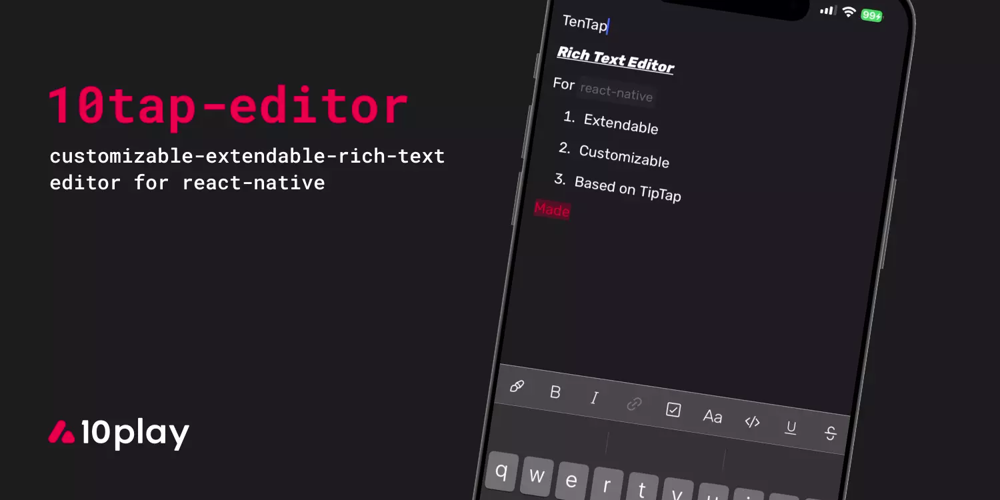
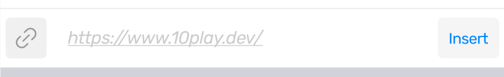
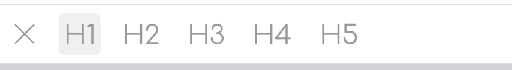

# tentap-editor-heck



[](https://github.com/atheck/10tap-editor/blob/main/LICENSE)
[](https://www.npmjs.com/package/tentap-editor-heck)

TenTap is a typed, easy to use, customizable, and extendable Rich Text editor for React Native based on [Tiptap](https://tiptap.dev) and [ProseMirror](https://prosemirror.net). It offers a "plug and play" experience and comes with many essential features out of the box. Additionally, TenTap allows you to tailor the editor to your application's specific needs.

## Features

- 💁 Based on Tiptap
- ➕ Extendable
- ⚙️ Support dynamic scheme
- 🛠️ Native toolbar
- 💅 Customizable styles
- 🌒 Dark mode and custom theme support
- 🏗️ Supports new architecture\*

\* New arch supported on react-native version 0.73.5 and above

## Installation

### React Native

1. `npm install tentap-editor-heck react-native-webview`
2. `cd ios && pod install`

### Expo

```sh
npx expo install tentap-editor-heck react-native-webview
```

Only basic usage is supported by Expo Go. Otherwise you will need to set up [Expo Dev Client](https://docs.expo.dev/develop/development-builds/introduction/).

> **Note:** On Android, API level 29+ is required.

## Quick Start

```tsx
import React from 'react';
import {
  KeyboardAvoidingView,
  Platform,
  SafeAreaView,
  StyleSheet,
} from 'react-native';
import { RichText, Toolbar, useEditorBridge } from 'tentap-editor-heck';

export const Basic = () => {
  const editor = useEditorBridge({
    autofocus: true,
    avoidIosKeyboard: true,
    initialContent: '<p>Start editing!</p>',
  });

  return (
    <SafeAreaView style={styles.fullScreen}>
      <RichText editor={editor} />
      <KeyboardAvoidingView
        behavior={Platform.OS === 'ios' ? 'padding' : 'height'}
        style={styles.keyboardAvoidingView}
      >
        <Toolbar editor={editor} />
      </KeyboardAvoidingView>
    </SafeAreaView>
  );
};

const styles = StyleSheet.create({
  fullScreen: {
    flex: 1,
  },
  keyboardAvoidingView: {
    position: 'absolute',
    width: '100%',
    bottom: 0,
  },
});
```

## Core Concepts

**EditorBridge** is the bridge between native and the editor running inside a WebView. It is created with the `useEditorBridge` hook and passed to the `RichText` and `Toolbar` components.

**BridgeExtension** is a typed class that handles communication between the native side and the WebView. Each extension wraps one or more Tiptap extensions and exposes commands and state to native code.

**TenTapStarterKit** is the default set of all built-in bridge extensions. Calling `useEditorBridge()` without `bridgeExtensions` is equivalent to:

```tsx
const editor = useEditorBridge({
  bridgeExtensions: TenTapStarterKit,
});
```

You can pass a subset of extensions to restrict what formatting is available. For example, if you are building a chat app and don't want underline support, omit `UnderlineBridge` — this ensures that even pasted content with underline formatting won't be preserved.

---

## API Reference

### useEditorBridge

A React hook that creates and returns an [`EditorBridge`](#editorbridge).

| Prop | Type | Default | Description |
| --- | --- | --- | --- |
| `bridgeExtensions` | `BridgeExtension[]` | `TenTapStarterKit` | Extensions to add to the editor |
| `initialContent` | `string \| object` | `undefined` | Initial HTML string or JSON document |
| `autofocus` | `boolean` | `false` | Focus the editor on mount |
| `avoidIosKeyboard` | `boolean` | `false` | Keeps cursor above the keyboard by adding bottom padding equal to keyboard height. Works on both iOS and Android |
| `dynamicHeight` | `boolean` | `false` | When true, the WebView grows to match content height |
| `disableColorHighlight` | `boolean` | `undefined` | Disables selection highlight. Off by default on Android |
| `theme` | `EditorTheme` | `defaultEditorTheme` | Customize native-side styles (toolbar, WebView background, etc.) |
| `editable` | `boolean` | `true` | Set to `false` for read-only mode |
| `customSource` | `string` | `SimpleEditorBundleString` | Custom HTML string to replace the default editor bundle |
| `onChange` | `() => void` | — | Callback fired on every content change. Call `editor.getHTML()` / `getJSON()` / `getText()` inside it |
| `DEV` | `boolean` | `false` | Load `DEV_SERVER_URL` instead of the bundled HTML |
| `DEV_SERVER_URL` | `string` | `http://localhost:3000` | Dev server URL used when `DEV` is true |

---

### EditorBridge

The interface returned by `useEditorBridge`. All methods below are available when using `TenTapStarterKit`.

#### Core methods

| Method | Signature | Description |
| --- | --- | --- |
| `focus` | `(pos?) => void` | Focus the editor and open the keyboard |
| `blur` | `() => void` | Blur the editor and close the keyboard |
| `webviewRef` | `RefObject<WebView>` | Ref to the underlying WebView |
| `getEditorState` | `() => BridgeState` | Returns the latest editor state |
| `getHTML` | `() => Promise<string>` | Returns editor content as HTML |
| `getText` | `() => Promise<string>` | Returns editor content as plain text |
| `getJSON` | `() => Promise<object>` | Returns editor content as a JSON document |
| `setContent` | `(content: Content) => void` | Set editor content (HTML string or document object) |
| `setEditable` | `(editable: boolean) => void` | Toggle read-only mode |
| `setSelection` | `(from: number, to: number) => void` | Set the selection range |
| `injectCSS` | `(css: string, tag?: string) => void` | Create or update a stylesheet. Default `tag`: `"custom-css"` |
| `injectJS` | `(js: string) => void` | Inject JavaScript into the editor WebView |
| `updateScrollThresholdAndMargin` | `(offset: number) => void` | Update ProseMirror scroll threshold and margin |

#### Formatting methods

| Method | Signature | Description |
| --- | --- | --- |
| `toggleBold` | `() => void` | Toggle bold |
| `toggleItalic` | `() => void` | Toggle italic |
| `toggleUnderline` | `() => void` | Toggle underline |
| `toggleStrikethrough` | `() => void` | Toggle strikethrough |
| `toggleCode` | `() => void` | Toggle inline code |
| `toggleBlockquote` | `() => void` | Toggle blockquote |
| `toggleHeading` | `(level: number) => void` | Toggle heading at the given level |
| `toggleBulletList` | `() => void` | Toggle bullet list |
| `toggleOrderedList` | `() => void` | Toggle ordered list |
| `toggleTaskList` | `() => void` | Toggle task list |
| `liftTaskListItem` | `() => void` | Lift task list item |
| `sinkTaskListItem` | `() => void` | Sink task list item |
| `lift` | `() => void` | Lift list item |
| `sink` | `() => void` | Sink list item |
| `toggleCodeBlock` | `(language?: string) => void` | Toggle code block |
| `setCodeBlock` | `(language?: string) => void` | Set code block |
| `setTextAlign` | `('left' \| 'center' \| 'right' \| 'justify') => void` | Set text alignment |
| `unsetTextAlign` | `() => void` | Remove text alignment |
| `toggleSubscript` | `() => void` | Toggle subscript |
| `toggleSuperscript` | `() => void` | Toggle superscript |
| `setFontFamily` | `(fontFamily: string) => void` | Set font family |
| `unsetFontFamily` | `() => void` | Remove font family |
| `setFontSize` | `(fontSize: string) => void` | Set font size |
| `unsetFontSize` | `() => void` | Remove font size |
| `setHardBreak` | `() => void` | Insert a hard line break |
| `setHorizontalRule` | `() => void` | Insert a horizontal rule |
| `undo` | `() => void` | Undo last change |
| `redo` | `() => void` | Redo last undone change |
| `setColor` | `(color: string) => void` | Set text color |
| `unsetColor` | `() => void` | Remove text color |
| `setHighlight` | `(color: string) => void` | Set highlight color |
| `toggleHighlight` | `(color: string) => void` | Toggle highlight |
| `unsetHighlight` | `() => void` | Remove highlight |
| `setImage` | `(src: string) => void` | Insert an image by URL |
| `setLink` | `(link: string \| null) => void` | Set or remove a link |
| `setPlaceholder` | `(placeholder: string) => void` | Update placeholder text at runtime |
| `insertTable` | `() => void` | Insert a table |
| `deleteTable` | `() => void` | Delete the current table |
| `addColumnBefore` | `() => void` | Add a column before the current one |
| `addColumnAfter` | `() => void` | Add a column after the current one |
| `deleteColumn` | `() => void` | Delete the current column |
| `addRowBefore` | `() => void` | Add a row before the current one |
| `addRowAfter` | `() => void` | Add a row after the current one |
| `deleteRow` | `() => void` | Delete the current row |
| `mergeCells` | `() => void` | Merge selected cells |
| `splitCell` | `() => void` | Split the current cell |
| `goToNextCell` | `() => void` | Move focus to the next cell |
| `goToPreviousCell` | `() => void` | Move focus to the previous cell |
| `fixTables` | `() => void` | Normalize table structure |
| `toggleHeaderRow` | `() => void` | Toggle the header row |
| `toggleHeaderColumn` | `() => void` | Toggle the header column |
| `toggleHeaderCell` | `() => void` | Toggle the current cell as a header |

---

### BridgeState

The `BridgeState` reflects the latest state of the editor and is updated on every selection or content change. It is typically consumed via `useBridgeState`.

#### useBridgeState

```tsx
const editorState = useBridgeState(editor);
```

Subscribes to `BridgeState` changes and re-renders on every update.

#### Core state

| Property | Type | Description |
| --- | --- | --- |
| `editable` | `boolean` | Whether the editor is editable |
| `empty` | `boolean` | Whether the editor content is empty |
| `selection` | `{ from: number; to: number }` | Current selection range |
| `isFocused` | `boolean` | Whether the editor is focused |
| `isReady` | `boolean` | Whether the editor has fully loaded |

#### Formatting state

| Property | Type | Description |
| --- | --- | --- |
| `isBoldActive` / `canToggleBold` | `boolean` | Bold status |
| `isItalicActive` / `canToggleItalic` | `boolean` | Italic status |
| `isUnderlineActive` / `canToggleUnderline` | `boolean` | Underline status |
| `isStrikeActive` / `canToggleStrike` | `boolean` | Strikethrough status |
| `isCodeActive` / `canToggleCode` | `boolean` | Inline code status |
| `isCodeBlockActive` / `canToggleCodeBlock` | `boolean` | Code block status |
| `codeBlockLanguage` | `string \| undefined` | Active code block language |
| `isBlockquoteActive` / `canToggleBlockquote` | `boolean` | Blockquote status |
| `isBulletListActive` / `canToggleBulletList` | `boolean` | Bullet list status |
| `isOrderedListActive` / `canToggleOrderedList` | `boolean` | Ordered list status |
| `isTaskListActive` / `canToggleTaskList` | `boolean` | Task list status |
| `canLiftTaskListItem` / `canSinkTaskListItem` | `boolean` | Task list item indent status |
| `headingLevel` | `number \| undefined` | Active heading level, or `undefined` |
| `canToggleHeading` | `boolean` | Whether heading can be toggled |
| `canLift` / `canSink` | `boolean` | Whether list item can be lifted/sunk |
| `activeTextAlign` | `'left' \| 'center' \| 'right' \| 'justify' \| undefined` | Active text alignment |
| `canSetTextAlign` | `boolean` | Whether text alignment can be set |
| `isSubscriptActive` / `canToggleSubscript` | `boolean` | Subscript status |
| `isSuperscriptActive` / `canToggleSuperscript` | `boolean` | Superscript status |
| `activeFontFamily` | `string \| undefined` | Active font family |
| `activeFontSize` | `string \| undefined` | Active font size |
| `canSetHorizontalRule` | `boolean` | Whether a horizontal rule can be inserted |
| `canUndo` / `canRedo` | `boolean` | Undo/redo availability |
| `activeColor` | `string \| undefined` | Active text color |
| `activeHighlight` | `string \| undefined` | Active highlight color |
| `isLinkActive` / `canSetLink` / `activeLink` | `boolean \| string \| undefined` | Link status |
| `isTableActive` / `canInsertTable` / `canDeleteTable` | `boolean` | Table presence status |
| `canAddColumnBefore` / `canAddColumnAfter` / `canDeleteColumn` | `boolean` | Table column operations |
| `canAddRowBefore` / `canAddRowAfter` / `canDeleteRow` | `boolean` | Table row operations |
| `canMergeCells` / `canSplitCell` | `boolean` | Table cell merge/split availability |
| `canGoToNextCell` / `canGoToPreviousCell` | `boolean` | Table cell navigation |
| `canToggleHeaderRow` / `canToggleHeaderColumn` / `canToggleHeaderCell` | `boolean` | Table header toggles |

---

### useEditorContent

A hook to efficiently subscribe to editor content changes. It debounces internal `getHTML` / `getText` / `getJSON` calls to reduce WebView traffic.

```tsx
const content = useEditorContent(editor, { type: 'html' });

useEffect(() => {
  content && onSave(content);
}, [content]);
```

| Option | Type | Default | Description |
| --- | --- | --- | --- |
| `type` | `'html' \| 'text' \| 'json'` | — | Content format to return |
| `debounceInterval` | `number` | `10` | Debounce delay in ms |

---

### Components

#### RichText

Renders the editor inside a WebView.

| Prop | Type | Default | Description |
| --- | --- | --- | --- |
| `editor` | `EditorBridge` | required | The bridge instance from `useEditorBridge` |
| `exclusivelyUseCustomOnMessage` | `boolean` | `true` | When true, a custom `onMessage` prop overrides TenTap's own handler |

Any standard [WebView prop](https://github.com/react-native-webview/react-native-webview/blob/HEAD/docs/Reference.md) can be passed, though this is not recommended.

#### Toolbar

A pre-built toolbar component with formatting controls.




| Prop | Type | Default | Description |
| --- | --- | --- | --- |
| `editor` | `EditorBridge` | required | The bridge instance from `useEditorBridge` |
| `hidden` | `boolean` | — | Hide the toolbar |
| `items` | `ToolbarItem[]` | `DEFAULT_TOOLBAR_ITEMS` | Toolbar items to display |
| `shouldHideDisabledToolbarItems` | `boolean` | `false` | Hide disabled items instead of showing them greyed out |

Built-in toolbar items: `link`, `quote`, `code`, `bold`, `italic`, `checkList`, `underline`, `strikethrough`, `h1`–`h6`, `orderedList`, `bulletList`, `sync`, `lift`, `undo`, `redo`.

##### ToolbarItem

```ts
export interface ToolbarItem {
  onPress: ({ editor, editorState }: ArgsToolbarCB) => () => void;
  active: ({ editor, editorState }: ArgsToolbarCB) => boolean;
  disabled: ({ editor, editorState }: ArgsToolbarCB) => boolean;
  image: ({ editor, editorState }: ArgsToolbarCB) => any;
}

type ArgsToolbarCB = {
  editor: EditorBridge;
  editorState: BridgeState;
};
```

---

### Built-in BridgeExtensions

All extensions below are included in `TenTapStarterKit`. Each can be configured with `BridgeExtension.configureExtension(options)`.

| Extension | Tiptap packages | Configuration |
| --- | --- | --- |
| `CoreExtension` | `@tiptap/extension-document`, `@tiptap/extension-paragraph`, `@tiptap/extension-text` | — |
| `BlockquoteBridge` | `@tiptap/extension-blockquote` | [docs](https://tiptap.dev/docs/editor/api/nodes/blockquote#settings) |
| `BoldBridge` | `@tiptap/extension-bold` | [docs](https://tiptap.dev/docs/editor/api/marks/bold#settings) |
| `BulletListBridge` | `@tiptap/extension-list` | [docs](https://tiptap.dev/docs/editor/api/nodes/bullet-list#settings) |
| `CodeBridge` | `@tiptap/extension-code` | [docs](https://tiptap.dev/docs/editor/api/marks/code#settings) |
| `CodeBlockBridge` | `@tiptap/extension-code-block` | [docs](https://tiptap.dev/docs/editor/api/nodes/code-block#settings) |
| `ColorBridge` | `@tiptap/extension-color` | — |
| `DropCursorBridge` | `@tiptap/extensions` | — |
| `FontFamilyBridge` | `@tiptap/extension-font-family` | [docs](https://tiptap.dev/docs/editor/api/extensions/font-family#settings) |
| `FontSizeBridge` | custom extension (extends `@tiptap/core`) | — |
| `HardBreakBridge` | `@tiptap/extension-hard-break` | [docs](https://tiptap.dev/docs/editor/api/nodes/hard-break#settings) |
| `HeadingBridge` | `@tiptap/extension-heading` | [docs](https://tiptap.dev/docs/editor/api/nodes/heading#settings) |
| `HighlightBridge` | `@tiptap/extension-highlight` | — |
| `HistoryBridge` | `@tiptap/extensions` | — |
| `HorizontalRuleBridge` | `@tiptap/extension-horizontal-rule` | [docs](https://tiptap.dev/docs/editor/api/nodes/horizontal-rule#settings) |
| `ImageBridge` | `@tiptap/extension-image` | [docs](https://tiptap.dev/docs/editor/api/nodes/image#settings) |
| `ItalicBridge` | `@tiptap/extension-italic` | [docs](https://tiptap.dev/docs/editor/api/marks/italic#settings) |
| `LinkBridge` | `@tiptap/extension-link` | [docs](https://tiptap.dev/docs/editor/api/marks/link#settings) |
| `ListItemBridge` | `@tiptap/extension-list` | [docs](https://tiptap.dev/docs/editor/api/nodes/list-item#settings) |
| `OrderedListBridge` | `@tiptap/extension-list` | [docs](https://tiptap.dev/docs/editor/api/nodes/ordered-list#settings) |
| `PlaceholderBridge` | `@tiptap/extensions` | [docs](https://tiptap.dev/docs/editor/api/extensions/placeholder#settings) |
| `StrikeBridge` | `@tiptap/extension-strike` | [docs](https://tiptap.dev/docs/editor/api/marks/strike#settings) |
| `SubscriptBridge` | `@tiptap/extension-subscript` | [docs](https://tiptap.dev/docs/editor/api/marks/subscript#settings) |
| `SuperscriptBridge` | `@tiptap/extension-superscript` | [docs](https://tiptap.dev/docs/editor/api/marks/superscript#settings) |
| `TableBridge` | `@tiptap/extension-table`, `@tiptap/extension-table-row`, `@tiptap/extension-table-cell`, `@tiptap/extension-table-header` | [docs](https://tiptap.dev/docs/editor/api/nodes/table#settings) |
| `TaskListBridge` | `@tiptap/extension-list` | [docs](https://tiptap.dev/docs/editor/api/nodes/task-list#settings) |
| `TextAlignBridge` | `@tiptap/extension-text-align` | [docs](https://tiptap.dev/docs/editor/api/extensions/text-align#settings) |
| `TextStyleBridge` | `@tiptap/extension-text-style` | [docs](https://tiptap.dev/docs/editor/api/marks/text-style#settings) |
| `TrailingNodeBridge` | `@tiptap/extensions` | — |
| `UnderlineBridge` | `@tiptap/extension-underline` | [docs](https://tiptap.dev/docs/editor/api/marks/underline#settings) |

> **Note:** `ListItemBridge` is only needed if you want to control list item `lift`/`sink`. Otherwise `BulletListBridge` or `OrderedListBridge` alone is sufficient.
> `FontFamilyBridge`, `FontSizeBridge`, `ColorBridge`, `HighlightBridge`, and `TextAlignBridge` require `TextStyleBridge` to be present in `bridgeExtensions`.

---

## Examples

### Configure Extensions

Each bridge exposes `configureExtension` to pass options to the underlying Tiptap extension, and `extendExtension` to modify the extension schema.

```tsx
const editor = useEditorBridge({
  bridgeExtensions: [
    ...TenTapStarterKit,
    // Override an extension's options
    PlaceholderBridge.configureExtension({
      placeholder: 'Type something...',
    }),
    LinkBridge.configureExtension({ openOnClick: false }),
  ],
});
```

To modify the document schema — for example, to require a heading as the first node:

```tsx
CoreBridge.extendExtension({ content: 'heading block+' });
```

---

### Custom CSS and Fonts

#### Override a bridge's CSS

```tsx
const customCodeBlockCSS = `
code {
    background-color: #ffdede;
    border-radius: 0.25em;
    border-color: #e45d5d;
    border-width: 1px;
    border-style: solid;
    color: #cd4242;
    font-size: 0.9rem;
    padding: 0.25em;
}
`;

const editor = useEditorBridge({
  bridgeExtensions: [
    ...TenTapStarterKit,
    // Spread TenTapStarterKit BEFORE overriding — duplicates are ignored
    CodeBridge.configureCSS(customCodeBlockCSS),
  ],
});
```

> Calling `configureCSS` more than once on the same bridge will override the previous CSS.

#### Dynamically inject CSS at runtime

```ts
// Replace or create a stylesheet identified by tag
editor.injectCSS(newCSS, CodeBridge.name);

// Add CSS without touching any bridge's existing stylesheet
editor.injectCSS(newCSS, 'my-custom-tag');
```

#### Add a custom font

1. Convert your font to base64 using [transfonter.org](https://transfonter.org) (enable the "base64" option).
1. Export the resulting CSS as a string:

   ```ts
   export const ProtestRiotFont = `
     @font-face {
       font-family: 'Protest Riot';
       src: url('data:font/woff2;charset=utf-8;base64,...');
     }
   `;
   ```

1. Apply it via `CoreBridge.configureCSS`:

   ```tsx
   const customFont = `
     ${ProtestRiotFont}
     * { font-family: 'Protest Riot', sans-serif; }
   `;

   const editor = useEditorBridge({
     bridgeExtensions: [
       ...TenTapStarterKit,
       CoreBridge.configureCSS(customFont),
     ],
   });
   ```

---

### Dark Theme

```tsx
import { darkEditorTheme, darkEditorCss } from 'tentap-editor-heck';

const editor = useEditorBridge({
  bridgeExtensions: [
    ...TenTapStarterKit,
    CoreBridge.configureCSS(darkEditorCss),
  ],
  theme: darkEditorTheme,
});
```

---

### Custom Theme

```tsx
useEditorBridge({
  theme: {
    toolbar: {
      toolbarBody: {
        borderTopColor: '#C6C6C6B3',
        borderBottomColor: '#C6C6C6B3',
        backgroundColor: '#474747',
      },
      // See ToolbarTheme type for all options
    },
    webview: {
      backgroundColor: '#1C1C1E',
    },
    webviewContainer: {},
  },
});
```

---

### Toolbar with Navigation Header

When using `react-navigation`'s header on iOS, add a `keyboardVerticalOffset` equal to the safe area top inset plus the header height to keep the toolbar directly above the keyboard:

```tsx
const HEADER_HEIGHT = 38; // iOS only
const { top } = useSafeAreaInsets();
const keyboardVerticalOffset = HEADER_HEIGHT + top;

// ...

<View style={styles.contentContainer}>
  <RichText editor={editor} />
</View>
<KeyboardAvoidingView
  behavior="padding"
  style={styles.keyboardAvoidingView}
  keyboardVerticalOffset={Platform.OS === 'ios' ? keyboardVerticalOffset : undefined}
>
  <Toolbar editor={editor} />
</KeyboardAvoidingView>

// ...

const styles = StyleSheet.create({
  contentContainer: {
    flex: 1,
    paddingBottom: Platform.OS === 'ios' ? HEADER_HEIGHT : 0,
  },
  keyboardAvoidingView: {
    position: 'absolute',
    width: '100%',
    bottom: 0,
  },
});
```

---

## Contributing

See the [contributing guide](https://github.com/atheck/10tap-editor/blob/main/CONTRIBUTING.md) to learn how to contribute to the repository and the development workflow.

## License

MIT
